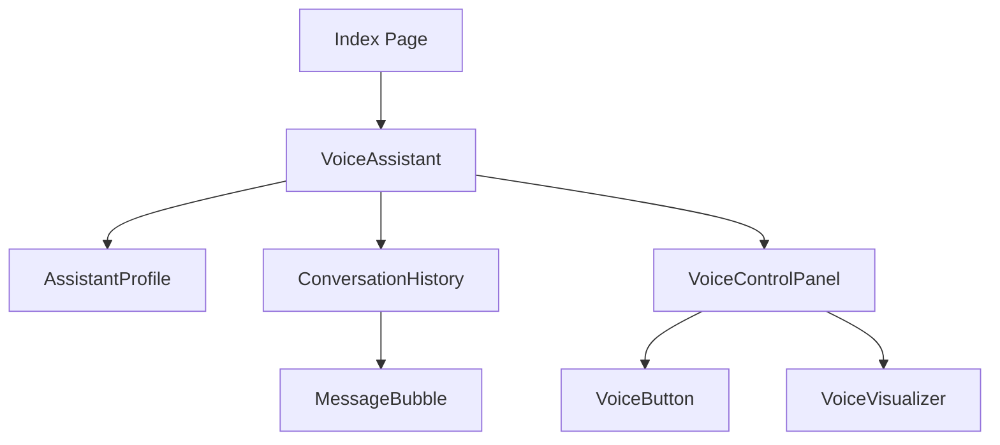

# UI Components Documentation

## Core UI Components
- Built using **shadcn/ui** primitives
- Includes common UI elements:
  - Buttons, forms, toasts, tooltips
  - Accordions, dialogs, dropdowns
  - Inputs, selects, checkboxes

## Voice Interaction Components

### VoiceAssistant
Main wrapper component for voice functionality
- **Props**:
  - `assistantName`: Name of the assistant (default: 'Rósa')
  - `gender`: Gender of the assistant ('female' | 'male')
- **Responsibilities**:
  - Coordinates all voice interaction components
  - Manages message state and voice processing

### ConversationHistory
Displays the conversation between user and assistant
- **Props**:
  - `messages`: Array of message objects to display
- **Features**:
  - Auto-scrolling to most recent messages
  - Visual differentiation between user and assistant messages

### VoiceControlPanel
Controls for voice recording and feedback
- **Props**:
  - `isListening`: Boolean indicating if recording is active
  - `isProcessing`: Boolean indicating if audio is being processed
  - `isSpeaking`: Boolean indicating if assistant is speaking
  - `transcribedText`: Current transcription text
  - `lastTranscribedText`: Previously transcribed text
  - `onButtonClick`: Handler for voice button clicks
- **Features**:
  - Shows recording status and transcription text
  - Controls for starting/stopping voice recording

### VoiceButton
Button component to initiate/terminate voice interaction
- **Props**:
  - `isListening`: Boolean indicating if recording is active
  - `isProcessing`: Boolean indicating if processing is happening
  - `onClick`: Handler for button clicks
- **Features**:
  - Visual feedback for recording state
  - Disabled state during processing

### VoiceVisualizer
Visual feedback for voice input
- **Props**:
  - `isActive`: Boolean controlling active state
- **Features**:
  - Animated bars representing voice activity

### AssistantProfile
Displays assistant information and status
- **Props**:
  - `name`: Name of the assistant
  - `isActive`: Boolean indicating if assistant is active
  - `gender`: Gender of the assistant ('female' | 'male')
- **Features**:
  - Avatar display with appropriate image
  - Activity indicator

### MessageBubble
Individual message display component
- **Props**:
  - `message`: Text content of the message
  - `isUser`: Boolean indicating if message is from user
- **Features**:
  - Different styling for user vs assistant messages
  - Animation for new messages

## Component Relationships

## Hooks
- **useAudioRecording**: Manages voice recording and transcription
- **useAudioPlayback**: Handles text-to-speech functionality
- **useMessageService**: Manages conversation state and history

## Services
- **openAiService**: Connects to OpenAI for transcription and TTS
- **chatService**: Handles conversation with AI assistant
- **messageService**: Manages conversation state and history

## Utilities
- **audioUtils**: Helper functions for audio processing and validation
