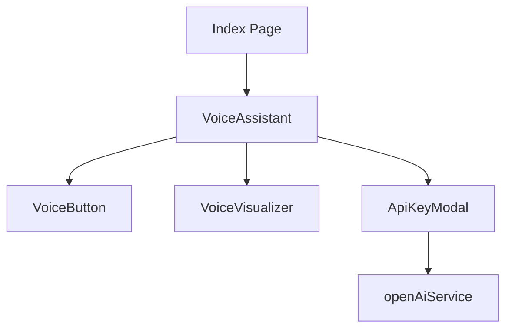

# UI Components Documentation

## Core UI Components
- Built using **shadcn/ui** primitives
- Includes common UI elements:
  - Buttons, forms, toasts, tooltips
  - Accordions, dialogs, dropdowns
  - Inputs, selects, checkboxes

## Voice Interaction Components
### VoiceAssistant
Main wrapper component for voice functionality

### VoiceButton
Button component to initiate/terminate voice interaction

### VoiceVisualizer
Visual feedback for voice input

### ApiKeyModal
Handles OpenAI API key input and validation

## Component Relationships


## Usage Examples
```tsx
// Example usage of VoiceButton
<VoiceButton 
  onStart={handleStartRecording}
  onStop={handleStopRecording}
/>
```

## Props Documentation
See individual component files in `src/components/` for detailed prop types.